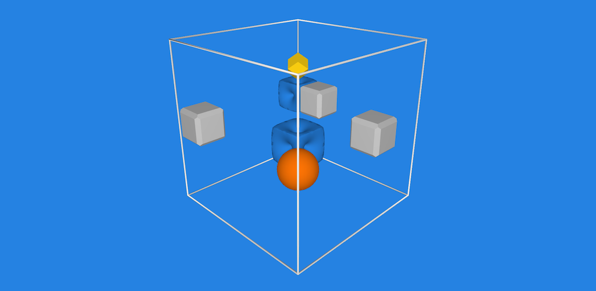

PerspectiveAndroid
==================

This is an Android implementation of Perspective - 3D puzzle game.

Setup
=====

AAR Libraries

    ln -s <awcommonandroidaardebug> aletheiaware-common-android/app-debug.aar
    ln -s <awcommonandroidaarrelease> aletheiaware-common-android/app-release.aar

    ln -s <joyandroidaardebug> joy-android/app-debug.aar
    ln -s <joyandroidaarrelease> joy-android/app-release.aar

Libraries

    mkdir app/libs
    ln -s <awcommonjavalib> app/libs/AletheiaWareCommonJava.jar
    ln -s <perspectivejavalib> app/libs/PerspectiveJava.jar
    ln -s <joyandroidaar> joy-android/app-debug.aar

Build
=====

    ./gradlew build
